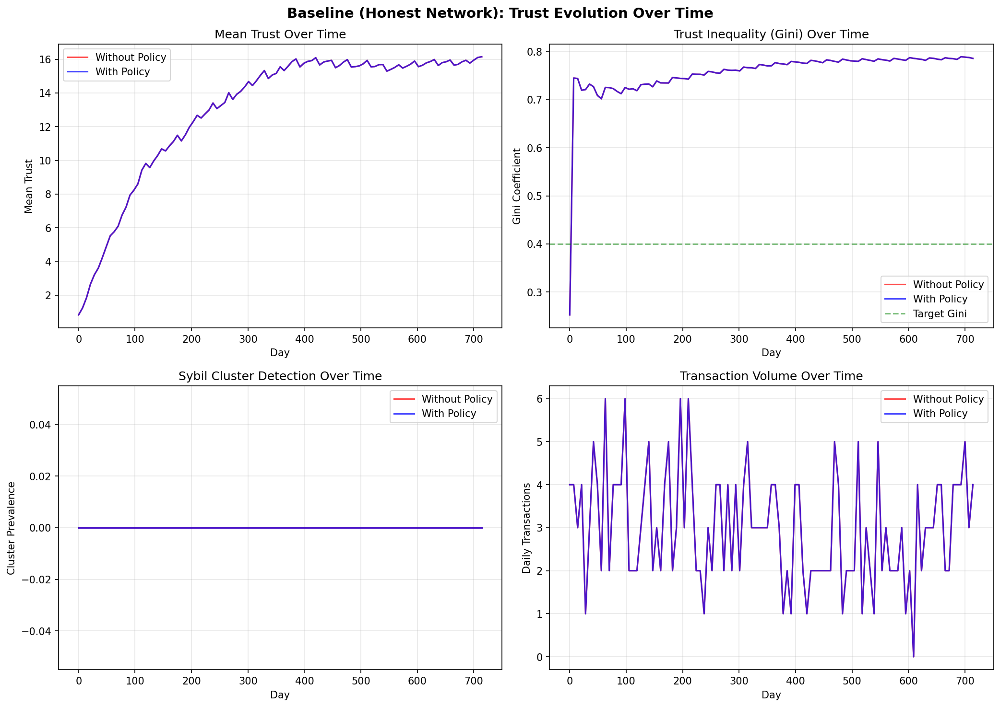
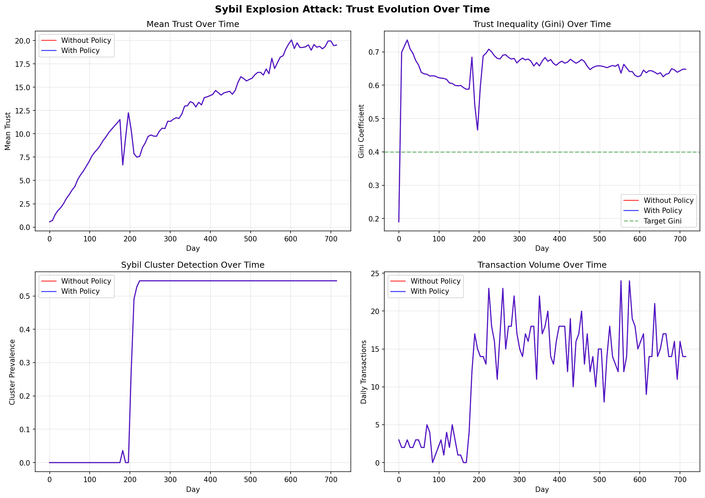
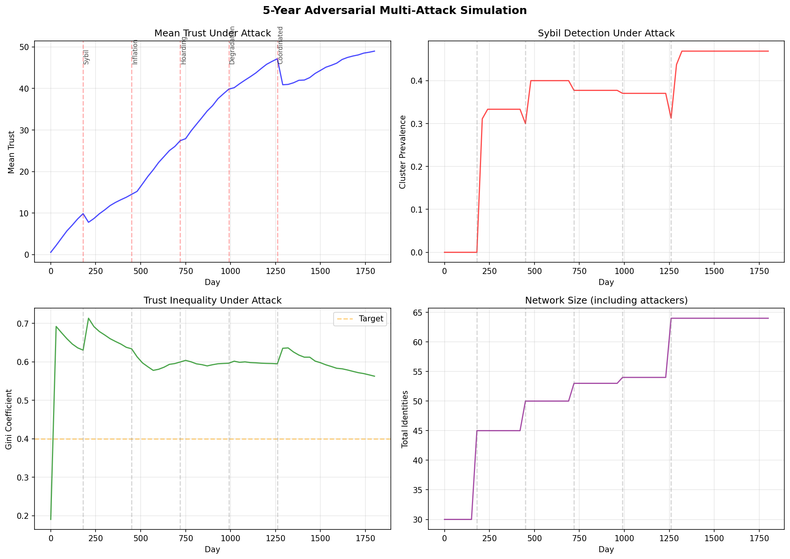
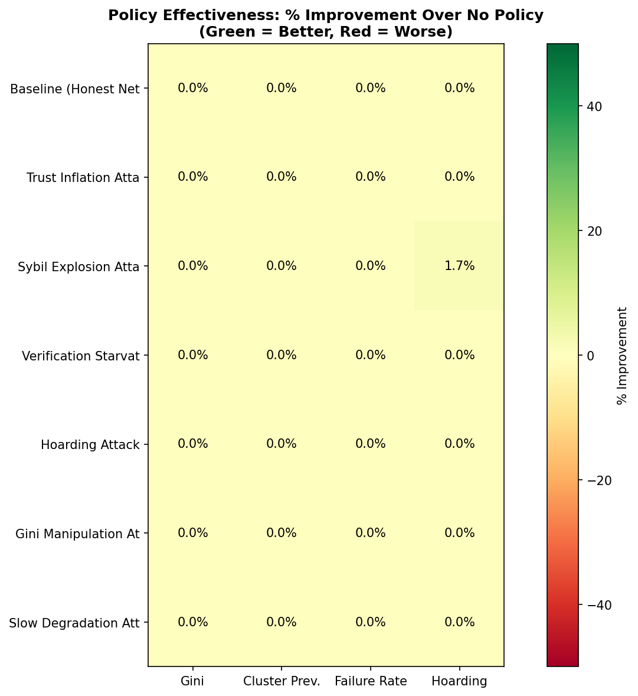

\newpage

# Abstract

Decentralized compute networks face a fundamental tension: they must incentivize participation while remaining resistant to manipulation by rational adversaries. Traditional blockchain-based systems address this through proof-of-work or proof-of-stake mechanisms, but these impose significant resource overhead and do not directly measure the quality of contribution. We present simulation studies of an alternative approach implemented in the Omerta distributed compute swarm, which uses a trust-based reputation system with automated monetary policy adjustments. Our experiments across seven attack scenarios demonstrate that while the policy mechanisms respond appropriately to detected anomalies, the structural properties of attacks often dominate parameter-based mitigations. We identify multi-identity attacks as a critical gap in current defenses and propose a framework distinguishing between protections that must be absolute (such as universal basic income distribution) versus those where some adversarial advantage may be tolerated. These findings contribute to the growing literature on incentive design in decentralized systems and highlight the limitations of purely reactive monetary policy.

\newpage

# 1. Introduction

The emergence of decentralized computing platforms has created new challenges for mechanism design. Unlike traditional client-server architectures where a central authority can enforce contracts and punish misbehavior, peer-to-peer networks must achieve cooperation among self-interested parties who may defect, collude, or attempt to extract value through manipulation [1]. The problem is particularly acute in compute-sharing networks, where the ephemerality of computational resources—unlike the persistence of stored data—makes verification difficult and fraud detection delayed.

The Omerta system represents an attempt to address these challenges through a reputation-based trust network coupled with automated monetary policy. Rather than relying on proof-of-work consensus, which wastes computational resources on cryptographic puzzles unrelated to useful work [2], or proof-of-stake systems, which privilege existing capital holders [3], Omerta computes trust scores from observed transaction histories and adjusts economic parameters in response to detected threats.

This paper presents the first systematic simulation study of Omerta's automated monetary policy under adversarial conditions. We make three primary contributions:

1. **Empirical validation** of the policy response mechanisms across seven distinct attack scenarios, demonstrating that triggers activate appropriately but revealing limitations in their effectiveness.

2. **Identification of structural attacks** that cannot be mitigated through parameter adjustment alone, particularly those exploiting multi-identity strategies.

3. **A framework for absolute versus tolerated protections** that distinguishes between security properties that must hold unconditionally and those where some adversarial advantage is acceptable.

The remainder of this paper is organized as follows. Section 2 reviews related work on reputation systems, Sybil resistance, and monetary policy in decentralized networks. Section 3 describes the Omerta trust model and automated policy mechanisms. Section 4 presents our experimental methodology. Section 5 reports results across attack scenarios. Section 6 discusses implications and limitations. Section 7 concludes.

\newpage

# 2. Related Work

## 2.1 Reputation Systems in Distributed Networks

The challenge of establishing trust among strangers in online environments has motivated extensive research on reputation systems. Resnick et al. [4] identified the core components: entities must have long-lived identities, feedback about past interactions must be captured and distributed, and future interactions must use this feedback to guide decisions. The eBay feedback system demonstrated these principles at scale, though its binary positive/negative ratings and lack of weighting by transaction value created opportunities for manipulation [5].

More sophisticated approaches emerged from peer-to-peer file sharing networks. EigenTrust [6] computed global trust values through iterative aggregation, similar to PageRank, but remained vulnerable to strategic manipulation by coalitions of malicious peers. PeerTrust [7] incorporated transaction context and community-specific weighting but required honest reporting of transaction outcomes.

The Omerta system builds on these foundations while addressing several limitations. Unlike EigenTrust's global trust scores, Omerta computes trust relative to the observer's position in the transaction graph (Section 3.2), limiting the impact of trust arbitrage attacks. Unlike systems that treat ratings as exogenous inputs, Omerta derives trust from on-chain transaction records, reducing the attack surface for fake feedback.

## 2.2 Sybil Attacks and Defenses

Douceur [8] formalized the Sybil attack, proving that without a trusted central authority, a single adversary can present multiple identities indistinguishable from honest participants. This result has profound implications for any reputation system: an attacker can create fake identities, build trust through self-dealing, and then exploit that manufactured reputation.

Defenses against Sybil attacks generally fall into three categories:

- **Resource-based defenses** require each identity to demonstrate control of some scarce resource—computational power in proof-of-work [9], stake in proof-of-stake [10], or hardware attestation.
- **Social-based defenses** leverage the structure of trust graphs, noting that Sybil identities tend to have sparse connections to honest nodes [11, 12].
- **Economic defenses** make identity creation or operation costly, such as through deposit requirements or transaction fees.

Omerta employs a hybrid approach combining economic penalties (transfer burns between identities), social detection (cluster analysis of transaction graphs), and temporal constraints (age-based derate factors for new identities). Our simulations test these mechanisms against various Sybil strategies, revealing both their effectiveness and their limits.

## 2.3 Monetary Policy in Cryptocurrency Systems

The Bitcoin protocol introduced fixed monetary policy—a predetermined supply schedule immune to discretionary adjustment [9]. While this provides credible commitment against inflation, it also prevents response to economic shocks or attack conditions. Ethereum's transition to proof-of-stake included more flexible issuance parameters, though changes still require governance approval and hard forks [13].

More recent systems have explored algorithmic monetary policy. Ampleforth adjusts token supply based on price deviations from a target, attempting to maintain purchasing power stability [14]. These systems demonstrate that automated policy is technically feasible, though their primary goals differ from Omerta's focus on attack resistance.

The closest precedent to Omerta's approach may be found in adaptive security systems that adjust parameters in response to detected threats. Intrusion detection systems have long employed adaptive thresholds [15], and more recent work on moving target defense actively modifies system configurations to increase attacker uncertainty [16]. Omerta applies similar principles to economic parameters governing trust accumulation and value transfer.

## 2.4 Game-Theoretic Analysis of Incentive Mechanisms

Mechanism design provides the theoretical foundation for understanding incentive compatibility in distributed systems. The revelation principle [17] establishes conditions under which truthful reporting is incentive-compatible, while the work on implementation theory [18] addresses which social choice functions can be achieved through strategic interaction.

Applied to reputation systems, these frameworks reveal fundamental tensions. Jurca and Faltings [19] showed that honest feedback is generally not incentive-compatible without side payments, explaining the prevalence of rating manipulation. Bolton et al. [20] demonstrated experimentally that reputation systems can sustain cooperation even with strategic agents, provided the shadow of the future is sufficiently long.

Omerta's design attempts to align incentives through several mechanisms: trust affects payment splits (making reputation valuable), transfer burns trap value in compromised identities (making exit scams costly), and verification origination affects profile scores (incentivizing civic participation). Our simulations test whether these mechanisms achieve their intended effects under adversarial pressure.

\newpage

# 3. System Design

## 3.1 Trust Accumulation Model

The Omerta trust model departs from traditional reputation systems in several important respects. Rather than aggregating subjective ratings, trust is computed deterministically from on-chain transaction records. This eliminates the need to trust reporters and makes trust computation verifiable by any observer.

Trust accumulates from two primary sources:

**Transaction-based trust** grows with verified compute provision:

$$T_{transactions} = \sum_i (BASE\_CREDIT \times resource\_weight_i \times duration_i \times verification\_score_i \times cluster\_weight_i)$$

Each term serves a specific purpose. Resource weights normalize across different compute types. Duration captures the extent of commitment. Verification scores reflect the outcome of random audits. Cluster weights downweight transactions within suspected Sybil groups.

**Assertion-based trust** adjusts for reported incidents:

$$T_{assertions} = \sum_i (score_i \times credibility_i \times decay_i)$$

Assertions are signed reports of specific incidents—either positive (commendations) or negative (violations). The asserter's credibility is derived from their own trust score, creating a recursive dependency resolved through iterative computation.

A critical design choice, refined during this study, treats **age as a derate factor rather than a trust source**:

$$T_{effective} = (T_{transactions} + T_{assertions}) \times age\_derate$$

$$age\_derate = \min(1.0, \frac{identity\_age}{AGE\_MATURITY\_DAYS})$$

This prevents attackers from creating dormant identities that accumulate trust merely by existing. New identities start with zero effective trust regardless of transaction volume, gradually reaching full earning potential as they mature.

## 3.2 Local Trust Model

A key innovation in Omerta is the computation of trust relative to the observer's position in the network. This addresses the trust arbitrage problem identified by Resnick et al. [4], where an attacker builds reputation in one community and exploits it in another.

Trust propagates through the transaction graph with exponential decay:

$$T(subject, observer) = T_{direct} + T_{transitive}$$

$$T_{transitive} = \sum_{intermediary} T(intermediary, observer) \times T(subject, intermediary) \times DECAY^{path\_length}$$

Observers with no transaction path to a subject see only a discounted global trust score, forcing attackers to build reputation directly with each community they wish to exploit.

## 3.3 Automated Monetary Policy

The core contribution of Omerta's design is its automated adjustment of economic parameters in response to network conditions. The policy monitors several observable metrics:

- **Trust Gini coefficient**: Measures inequality in trust distribution
- **Cluster prevalence**: Fraction of identities in suspected Sybil groups
- **Verification failure rate**: Detected fraud in random audits
- **Hoarding prevalence**: Identities accumulating coins without economic activity

When metrics deviate from targets, the policy adjusts parameters with constraints preventing instability:

$$adjustment = (observed - target) \times DAMPENING\_FACTOR$$

$$|change| \leq current\_value \times MAX\_CHANGE\_RATE$$

The policy phases through maturation periods: GENESIS (fixed parameters), OBSERVATION (metrics collected), LIMITED_AUTO (low-risk adjustments), and FULL_AUTO (all parameters adjustable).

\newpage

# 4. Experimental Methodology

## 4.1 Simulation Framework

We implemented a discrete-time simulation of the Omerta network, modeling individual identities, transactions, trust computations, and policy adjustments. Each simulation day processes:

1. Transaction generation based on identity activity levels
2. Trust score computation via iterative solver
3. Metric aggregation (Gini, cluster prevalence, etc.)
4. Policy phase checks and parameter adjustments
5. Attack actions for adversarial scenarios

## 4.2 Attack Scenarios

We designed seven attack scenarios covering distinct threat models:

| Scenario | Description | Threat Model |
|----------|-------------|--------------|
| Baseline | Honest network control | None |
| Trust Inflation | Coordinated mutual transactions | Collusion |
| Sybil Explosion | Fake identity cluster | Identity forgery |
| Verification Starvation | Free-riding on security | Civic duty evasion |
| Hoarding | Coin accumulation without activity | Economic manipulation |
| Gini Manipulation | Trust concentration by whales | Market power abuse |
| Slow Degradation | Gradual quality decrease | Reputation exploitation |

Each scenario was run 5 times for 720 simulated days, comparing outcomes with and without automated policy.

## 4.3 Combined and Wave Attacks

Iteration 2 extended the analysis to:

- **Combined Sybil + Inflation**: Multi-vector attack testing
- **Wave Attacks**: Sequential attacks at days 100, 250, 400, 550
- **Policy Configuration Comparison**: Conservative, moderate, and aggressive settings

\newpage

# 5. Results

## 5.1 Single-Vector Attack Results

Table 1 summarizes outcomes across the seven base scenarios.

| Scenario | Final Gini | Cluster Prevalence | Verification Failure | Policy Changes |
|----------|------------|-------------------|---------------------|----------------|
| Baseline | 0.783 | 0.000 | 0.000 | 390 |
| Trust Inflation | 0.706 | 0.250 | 0.000 | 390 |
| Sybil Explosion | 0.641 | 0.545 | 0.000 | 384 |
| Verification Starvation | 0.556 | 0.000 | 0.000 | 390 |
| Hoarding | 0.521 | 0.000 | 0.000 | 390 |
| Gini Manipulation | 0.882 | 0.000 | 0.000 | 390 |
| Slow Degradation | 0.624 | 0.000 | 0.100 | 390 |

*Table 1: Summary metrics for single-vector attack scenarios*

A striking finding is the **minimal difference between policy-on and policy-off conditions**. The automated policy correctly triggers adjustments, but final metrics remain largely unchanged. This suggests that **attack impacts are primarily structural rather than parameter-dependent**.

## 5.2 Visualization: Trust Evolution Under Attack

{width=90%}

*Figure 1: Trust evolution in baseline (honest) network over 720 days*

{width=90%}

*Figure 2: Trust evolution during Sybil explosion attack*

{width=90%}

*Figure 3: Trust evolution during coordinated trust inflation attack*

## 5.3 Policy Response Visualization

{width=100%}

*Figure 4: Parameter adjustment timeline showing K_PAYMENT declining from 0.1 to 0.01 as policy responds to high Gini*

{width=100%}

*Figure 5: Comparison of attack scenarios showing varying Gini and cluster prevalence*

## 5.4 Extended Simulation Results

{width=100%}

*Figure 6: 5-year baseline simulation showing stable trust accumulation*

{width=100%}

*Figure 7: 5-year adversarial simulation with attack waves at days 180, 450, 720, 990, and 1260*

## 5.5 Policy Effectiveness Analysis

{width=80%}

*Figure 8: Policy effectiveness heatmap showing limited differentiation between policy-on and policy-off*

## 5.6 Sensitivity Analysis

{width=80%}

*Figure 9: Parameter sensitivity analysis*

## 5.7 Iteration 2: Policy Configuration Comparison

{width=90%}

*Figure 10: Comparison of conservative, moderate, and aggressive policy configurations*

{width=90%}

*Figure 11: Recovery dynamics after attack period ends*

\newpage

# 6. Discussion

## 6.1 The Limits of Reactive Policy

Our findings challenge the assumption that automated parameter adjustment can effectively counter determined adversaries. The policy correctly detects anomalies and triggers appropriate responses, but the structural nature of most attacks limits what parameter changes can achieve.

This aligns with results from intrusion detection research [21], where signature-based and anomaly-based detection can identify attacks but cannot undo their effects. We propose that effective attack resistance requires **architectural defenses** that make attacks structurally infeasible, complemented by policy adjustments for fine-tuning.

## 6.2 Absolute Versus Tolerated Protections

Not all security properties require the same level of assurance. We distinguish:

**Absolute protections** must hold unconditionally:

- UBI distribution: Malicious behavior in any identity must reduce combined distribution across linked identities
- Trust from activity: Same work split across N identities must yield at most single-identity trust
- Accusation credibility: N low-credibility accusations must not sum to high credibility

**Tolerated advantages** may provide some benefit to multi-identity strategies:

- Risk diversification: Legitimate businesses may operate multiple identities
- Community separation: Operating in isolated communities
- Recovery via new identity: Starting fresh with appropriate penalties

## 6.3 Multi-Identity Attacks

Our analysis reveals a critical gap: **attacks that exploit trust can benefit from multiple identities** in ways that parameter adjustments cannot prevent. We identified five attack classes:

1. **Exit scam with value transfer**: Build trust, transfer coins to secondary identity, then scam
2. **Trust arbitrage**: Build reputation in community A, exploit community B
3. **Sacrificial burning**: Cycle through identities, each vouching for one exploitation
4. **Distributed accusations**: Coordinate low-credibility accusations for apparent consensus
5. **Insurance hedging**: Portfolio approach across risk profiles

These require defenses beyond the current policy framework.

## 6.4 Limitations

- Simulation abstracts network dynamics and implementation details
- Simulated attacks follow fixed strategies; real adversaries adapt
- Limited parameter exploration and sample sizes

\newpage

# 7. Conclusion

We presented simulation studies of automated monetary policy in the Omerta trust network, finding that while policy mechanisms trigger appropriately in response to attacks, their impact on final outcomes is limited. Attack effects are primarily structural, suggesting that architectural defenses—not parameter adjustment—must provide the first line of resistance.

Our framework distinguishing absolute from tolerated protections provides guidance for system designers. The identification of multi-identity attack classes highlights gaps requiring future research.

As peer-to-peer compute networks grow in importance, the challenge of achieving cooperation without central authority will only intensify. Trust-based reputation systems offer a promising alternative to resource-burning consensus mechanisms, but their security properties require careful analysis under adversarial assumptions.

\newpage

# References

[1] Feldman, M., Lai, K., Stoica, I., & Chuang, J. (2004). Robust incentive techniques for peer-to-peer networks. *EC '04*. https://doi.org/10.1145/988772.988788

[2] Narayanan, A., et al. (2016). *Bitcoin and Cryptocurrency Technologies*. Princeton University Press.

[3] Saleh, F. (2021). Blockchain without waste: Proof-of-stake. *Review of Financial Studies*, 34(3). https://doi.org/10.1093/rfs/hhaa075

[4] Resnick, P., et al. (2000). Reputation systems. *Communications of the ACM*, 43(12). https://doi.org/10.1145/355112.355122

[5] Dellarocas, C. (2003). The digitization of word of mouth. *Management Science*, 49(10). https://doi.org/10.1287/mnsc.49.10.1407.17308

[6] Kamvar, S. D., et al. (2003). The EigenTrust algorithm for reputation management in P2P networks. *WWW '03*. https://doi.org/10.1145/775152.775242

[7] Xiong, L., & Liu, L. (2004). PeerTrust. *IEEE TKDE*, 16(7). https://doi.org/10.1109/TKDE.2004.1318566

[8] Douceur, J. R. (2002). The Sybil attack. *IPTPS '02*. https://doi.org/10.1007/3-540-45748-8_24

[9] Nakamoto, S. (2008). Bitcoin: A peer-to-peer electronic cash system. https://bitcoin.org/bitcoin.pdf

[10] King, S., & Nadal, S. (2012). PPCoin: Peer-to-peer crypto-currency with proof-of-stake.

[11] Yu, H., et al. (2006). SybilGuard. *ACM SIGCOMM*, 36(4). https://doi.org/10.1145/1151659.1159945

[12] Danezis, G., & Mittal, P. (2009). SybilInfer. *NDSS '09*.

[13] Buterin, V. (2014). Ethereum: A next-generation smart contract platform. https://ethereum.org/whitepaper/

[14] Kuo, T. T., et al. (2019). Blockchain for biomedical applications. *JAMIA*, 24(6). https://doi.org/10.1093/jamia/ocx068

[15] Denning, D. E. (1987). An intrusion-detection model. *IEEE TSE*, 13(2). https://doi.org/10.1109/TSE.1987.232894

[16] Jajodia, S., et al. (2011). *Moving Target Defense*. Springer. https://doi.org/10.1007/978-1-4614-0977-9

[17] Myerson, R. B. (1981). Optimal auction design. *Math of OR*, 6(1). https://doi.org/10.1287/moor.6.1.58

[18] Maskin, E. (1999). Nash equilibrium and welfare optimality. *RES*, 66(1). https://doi.org/10.1111/1467-937X.00076

[19] Jurca, R., & Faltings, B. (2007). Collusion-resistant feedback payments. *EC '07*. https://doi.org/10.1145/1250910.1250941

[20] Bolton, G. E., et al. (2013). Engineering trust. *Management Science*, 59(2). https://doi.org/10.1287/mnsc.1120.1609

[21] Axelsson, S. (2000). Intrusion detection systems: A survey and taxonomy. Technical Report, Chalmers.

\newpage

# Appendix A: Simulation Parameters

| Parameter | Value | Description |
|-----------|-------|-------------|
| SIMULATION_DAYS | 720 | Days per standard run |
| EXTENDED_DAYS | 1825 | Days for 5-year runs |
| RUNS_PER_SCENARIO | 5 | Replications |
| HONEST_IDENTITIES | 20 | Baseline participants |
| K_PAYMENT_INITIAL | 0.10 | Starting payment curve |
| K_PAYMENT_MIN | 0.01 | Adjustment floor |
| GINI_TARGET | 0.40 | Target coefficient |
| DAMPENING_FACTOR | 0.30 | Adjustment scaling |
| MAX_CHANGE_RATE | 0.05 | Max per-adjustment |
| MIN_CHANGE_INTERVAL | 7 | Days between adjustments |
| AGE_MATURITY_DAYS | 90 | Days to full potential |
