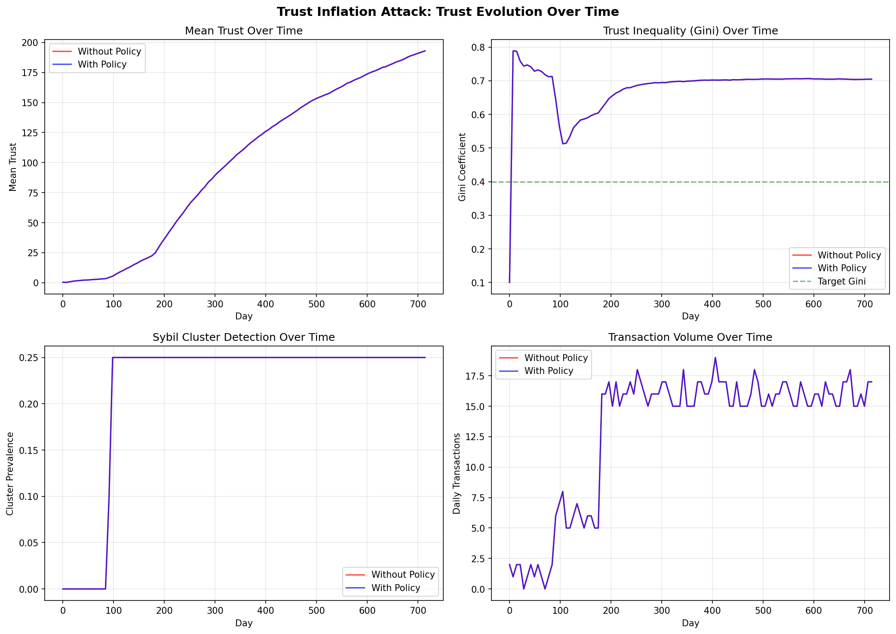
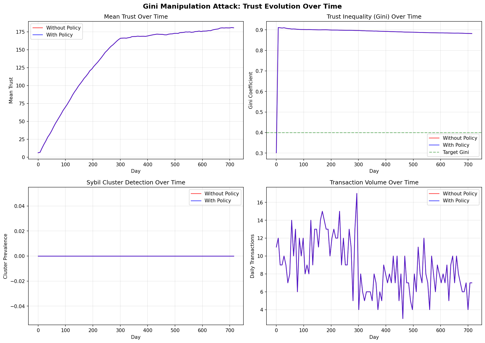
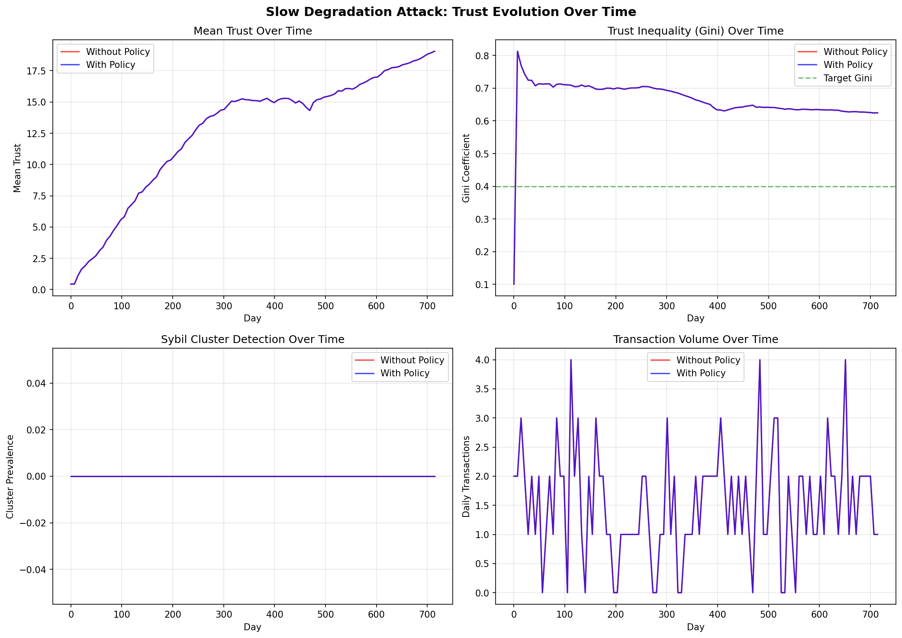
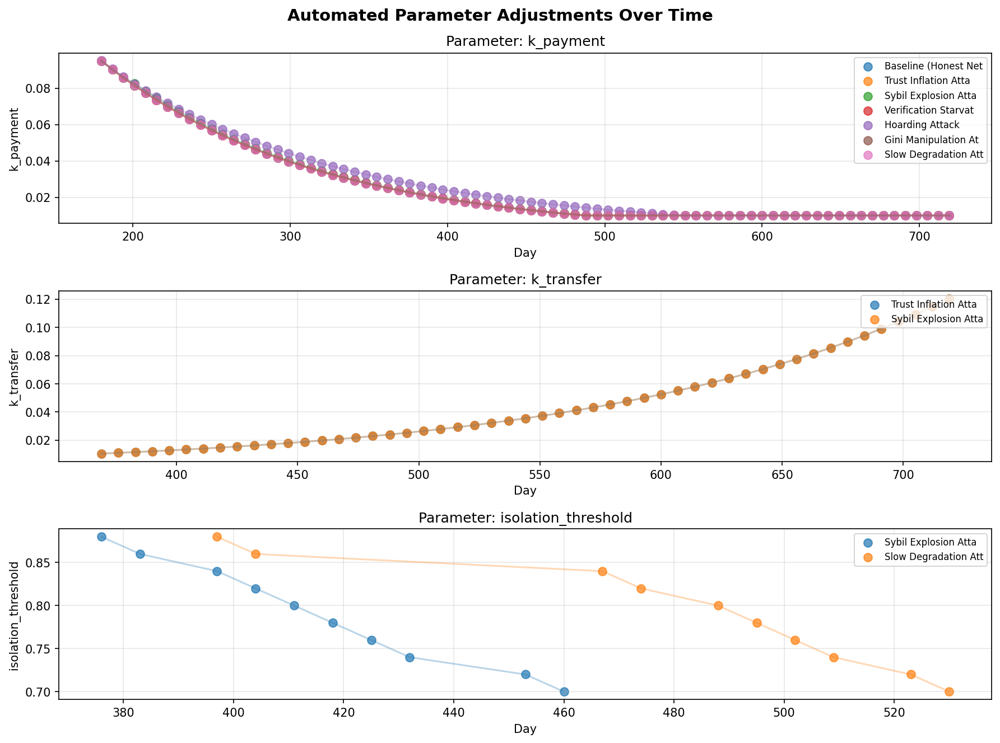
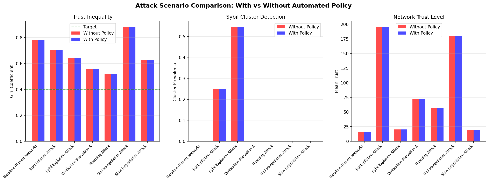
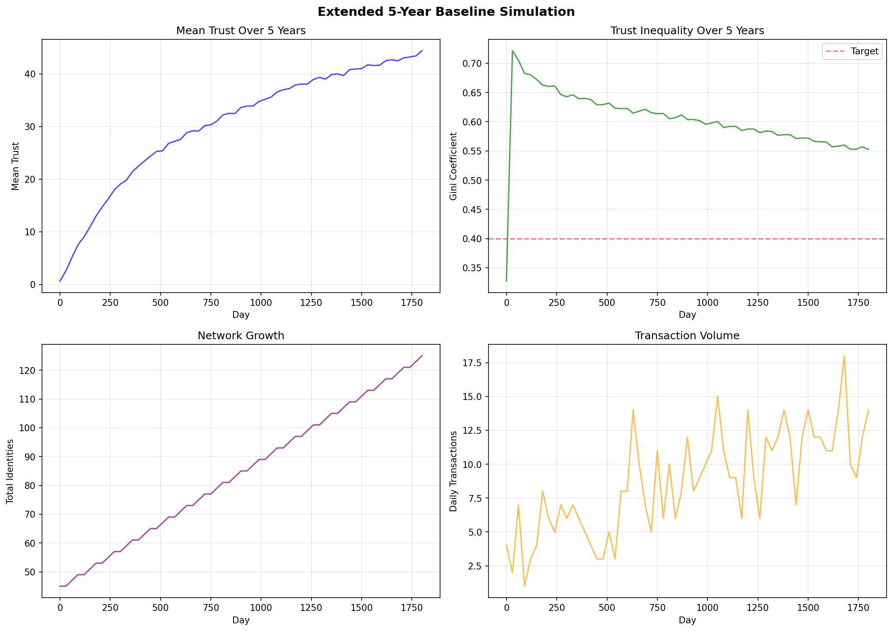
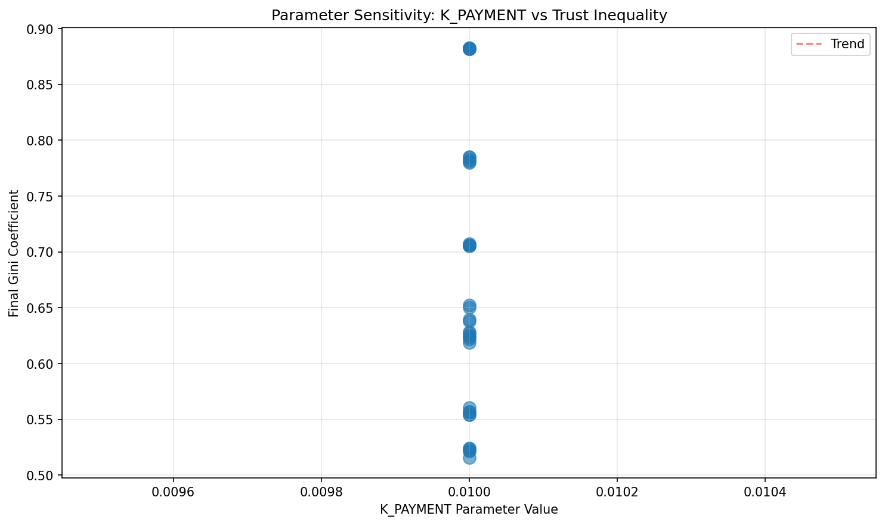

# Omerta Automated Monetary Policy Simulation Report

Generated: 2026-01-10T23:08:05.452385

## Executive Summary

This report presents the results of extensive simulations testing the 
automated monetary policy system for the Omerta trust network. 
Each scenario was run multiple times with and without automated policy adjustments.

### Results Summary

| Experiment | Metric | Without Policy | With Policy | Improvement |
|------------|--------|----------------|-------------|-------------|
| Baseline (Honest Network) | Gini | 0.783 | 0.783 | +0.0% |
| | Cluster Prevalence | 0.000 | 0.000 | +0.0% |
| Trust Inflation Attack | Gini | 0.706 | 0.706 | +0.0% |
| | Cluster Prevalence | 0.250 | 0.250 | +0.0% |
| Sybil Explosion Attack | Gini | 0.641 | 0.641 | +0.0% |
| | Cluster Prevalence | 0.545 | 0.545 | +0.0% |
| Verification Starvation Attack | Gini | 0.556 | 0.556 | +0.0% |
| | Cluster Prevalence | 0.000 | 0.000 | +0.0% |
| Hoarding Attack | Gini | 0.521 | 0.521 | +0.0% |
| | Cluster Prevalence | 0.000 | 0.000 | +0.0% |
| Gini Manipulation Attack | Gini | 0.882 | 0.882 | +0.0% |
| | Cluster Prevalence | 0.000 | 0.000 | +0.0% |
| Slow Degradation Attack | Gini | 0.624 | 0.624 | +0.0% |
| | Cluster Prevalence | 0.000 | 0.000 | +0.0% |

---

## Baseline (Honest Network)

- **Duration**: 720 days
- **Runs**: 5 per configuration

### Automated Policy Adjustments
Total parameter changes across all runs: 390

**Sample adjustments from Run 1:**

- Day 180 (LIMITED_AUTO):
  - `k_payment`: 0.1000 → 0.0950
    - Trigger: gini=0.734, target=0.4
- Day 187 (LIMITED_AUTO):
  - `k_payment`: 0.0950 → 0.0902
    - Trigger: gini=0.739, target=0.4
- Day 194 (LIMITED_AUTO):
  - `k_payment`: 0.0902 → 0.0857
    - Trigger: gini=0.745, target=0.4
- Day 201 (LIMITED_AUTO):
  - `k_payment`: 0.0857 → 0.0815
    - Trigger: gini=0.745, target=0.4
- Day 208 (LIMITED_AUTO):
  - `k_payment`: 0.0815 → 0.0774
    - Trigger: gini=0.744, target=0.4

**Final parameter values (Run 1):**

- `k_payment`: 0.0100
- `k_transfer`: 0.0100
- `tau_transaction`: 365.0000
- `isolation_threshold`: 0.9000

### Metrics Comparison

| Metric | Without Policy | With Policy |
|--------|----------------|-------------|
| Mean Trust | 15.63 | 15.63 |
| Trust Gini | 0.783 | 0.783 |
| Cluster Prevalence | 0.000 | 0.000 |
| Verification Failure Rate | 0.000 | 0.000 |

---

## Trust Inflation Attack

- **Duration**: 720 days
- **Runs**: 5 per configuration

### Automated Policy Adjustments
Total parameter changes across all runs: 390

**Sample adjustments from Run 1:**

- Day 180 (LIMITED_AUTO):
  - `k_payment`: 0.1000 → 0.0950
    - Trigger: gini=0.604, target=0.4
- Day 187 (LIMITED_AUTO):
  - `k_payment`: 0.0950 → 0.0902
    - Trigger: gini=0.614, target=0.4
- Day 194 (LIMITED_AUTO):
  - `k_payment`: 0.0902 → 0.0857
    - Trigger: gini=0.630, target=0.4
- Day 201 (LIMITED_AUTO):
  - `k_payment`: 0.0857 → 0.0815
    - Trigger: gini=0.644, target=0.4
- Day 208 (LIMITED_AUTO):
  - `k_payment`: 0.0815 → 0.0774
    - Trigger: gini=0.654, target=0.4

**Final parameter values (Run 1):**

- `k_payment`: 0.0100
- `k_transfer`: 0.1204
- `tau_transaction`: 365.0000
- `isolation_threshold`: 0.9000

### Metrics Comparison

| Metric | Without Policy | With Policy |
|--------|----------------|-------------|
| Mean Trust | 195.49 | 195.49 |
| Trust Gini | 0.706 | 0.706 |
| Cluster Prevalence | 0.250 | 0.250 |
| Verification Failure Rate | 0.000 | 0.000 |

---

## Sybil Explosion Attack

- **Duration**: 720 days
- **Runs**: 5 per configuration

### Automated Policy Adjustments
Total parameter changes across all runs: 384

**Sample adjustments from Run 1:**

- Day 180 (LIMITED_AUTO):
  - `k_payment`: 0.1000 → 0.0950
    - Trigger: gini=0.595, target=0.4
- Day 187 (LIMITED_AUTO):
  - `k_payment`: 0.0950 → 0.0902
    - Trigger: gini=0.617, target=0.4
- Day 194 (LIMITED_AUTO):
  - `k_payment`: 0.0902 → 0.0857
    - Trigger: gini=0.575, target=0.4
- Day 201 (LIMITED_AUTO):
  - `k_payment`: 0.0857 → 0.0826
    - Trigger: gini=0.522, target=0.4
- Day 208 (LIMITED_AUTO):
  - `k_payment`: 0.0826 → 0.0785
    - Trigger: gini=0.571, target=0.4

**Final parameter values (Run 1):**

- `k_payment`: 0.0100
- `k_transfer`: 0.1204
- `tau_transaction`: 365.0000
- `isolation_threshold`: 0.7000

### Metrics Comparison

| Metric | Without Policy | With Policy |
|--------|----------------|-------------|
| Mean Trust | 20.19 | 20.19 |
| Trust Gini | 0.641 | 0.641 |
| Cluster Prevalence | 0.545 | 0.545 |
| Verification Failure Rate | 0.000 | 0.000 |

---

## Verification Starvation Attack

- **Duration**: 720 days
- **Runs**: 5 per configuration

### Automated Policy Adjustments
Total parameter changes across all runs: 390

**Sample adjustments from Run 1:**

- Day 180 (LIMITED_AUTO):
  - `k_payment`: 0.1000 → 0.0950
    - Trigger: gini=0.576, target=0.4
- Day 187 (LIMITED_AUTO):
  - `k_payment`: 0.0950 → 0.0902
    - Trigger: gini=0.577, target=0.4
- Day 194 (LIMITED_AUTO):
  - `k_payment`: 0.0902 → 0.0857
    - Trigger: gini=0.578, target=0.4
- Day 201 (LIMITED_AUTO):
  - `k_payment`: 0.0857 → 0.0815
    - Trigger: gini=0.578, target=0.4
- Day 208 (LIMITED_AUTO):
  - `k_payment`: 0.0815 → 0.0774
    - Trigger: gini=0.578, target=0.4

**Final parameter values (Run 1):**

- `k_payment`: 0.0100
- `k_transfer`: 0.0100
- `tau_transaction`: 365.0000
- `isolation_threshold`: 0.9000

### Metrics Comparison

| Metric | Without Policy | With Policy |
|--------|----------------|-------------|
| Mean Trust | 72.23 | 72.23 |
| Trust Gini | 0.556 | 0.556 |
| Cluster Prevalence | 0.000 | 0.000 |
| Verification Failure Rate | 0.000 | 0.000 |

---

## Hoarding Attack

- **Duration**: 720 days
- **Runs**: 5 per configuration

### Automated Policy Adjustments
Total parameter changes across all runs: 390

**Sample adjustments from Run 1:**

- Day 180 (LIMITED_AUTO):
  - `k_payment`: 0.1000 → 0.0952
    - Trigger: gini=0.560, target=0.4
- Day 187 (LIMITED_AUTO):
  - `k_payment`: 0.0952 → 0.0907
    - Trigger: gini=0.559, target=0.4
- Day 194 (LIMITED_AUTO):
  - `k_payment`: 0.0907 → 0.0864
    - Trigger: gini=0.556, target=0.4
- Day 201 (LIMITED_AUTO):
  - `k_payment`: 0.0864 → 0.0824
    - Trigger: gini=0.553, target=0.4
- Day 208 (LIMITED_AUTO):
  - `k_payment`: 0.0824 → 0.0787
    - Trigger: gini=0.551, target=0.4

**Final parameter values (Run 1):**

- `k_payment`: 0.0100
- `k_transfer`: 0.0100
- `tau_transaction`: 365.0000
- `isolation_threshold`: 0.9000

### Metrics Comparison

| Metric | Without Policy | With Policy |
|--------|----------------|-------------|
| Mean Trust | 57.10 | 57.10 |
| Trust Gini | 0.521 | 0.521 |
| Cluster Prevalence | 0.000 | 0.000 |
| Verification Failure Rate | 0.000 | 0.000 |

---

## Gini Manipulation Attack

- **Duration**: 720 days
- **Runs**: 5 per configuration

### Automated Policy Adjustments
Total parameter changes across all runs: 390

**Sample adjustments from Run 1:**

- Day 180 (LIMITED_AUTO):
  - `k_payment`: 0.1000 → 0.0950
    - Trigger: gini=0.900, target=0.4
- Day 187 (LIMITED_AUTO):
  - `k_payment`: 0.0950 → 0.0902
    - Trigger: gini=0.900, target=0.4
- Day 194 (LIMITED_AUTO):
  - `k_payment`: 0.0902 → 0.0857
    - Trigger: gini=0.900, target=0.4
- Day 201 (LIMITED_AUTO):
  - `k_payment`: 0.0857 → 0.0815
    - Trigger: gini=0.899, target=0.4
- Day 208 (LIMITED_AUTO):
  - `k_payment`: 0.0815 → 0.0774
    - Trigger: gini=0.899, target=0.4

**Final parameter values (Run 1):**

- `k_payment`: 0.0100
- `k_transfer`: 0.0100
- `tau_transaction`: 365.0000
- `isolation_threshold`: 0.9000

### Metrics Comparison

| Metric | Without Policy | With Policy |
|--------|----------------|-------------|
| Mean Trust | 179.50 | 179.50 |
| Trust Gini | 0.882 | 0.882 |
| Cluster Prevalence | 0.000 | 0.000 |
| Verification Failure Rate | 0.000 | 0.000 |

---

## Slow Degradation Attack

- **Duration**: 720 days
- **Runs**: 5 per configuration

### Automated Policy Adjustments
Total parameter changes across all runs: 390

**Sample adjustments from Run 1:**

- Day 180 (LIMITED_AUTO):
  - `k_payment`: 0.1000 → 0.0950
    - Trigger: gini=0.697, target=0.4
- Day 187 (LIMITED_AUTO):
  - `k_payment`: 0.0950 → 0.0902
    - Trigger: gini=0.698, target=0.4
- Day 194 (LIMITED_AUTO):
  - `k_payment`: 0.0902 → 0.0857
    - Trigger: gini=0.700, target=0.4
- Day 201 (LIMITED_AUTO):
  - `k_payment`: 0.0857 → 0.0815
    - Trigger: gini=0.700, target=0.4
- Day 208 (LIMITED_AUTO):
  - `k_payment`: 0.0815 → 0.0774
    - Trigger: gini=0.700, target=0.4

**Final parameter values (Run 1):**

- `k_payment`: 0.0100
- `k_transfer`: 0.0100
- `tau_transaction`: 365.0000
- `isolation_threshold`: 0.7000

### Metrics Comparison

| Metric | Without Policy | With Policy |
|--------|----------------|-------------|
| Mean Trust | 19.25 | 19.25 |
| Trust Gini | 0.624 | 0.624 |
| Cluster Prevalence | 0.000 | 0.000 |
| Verification Failure Rate | 0.100 | 0.100 |

---

## Attack Analysis

This section analyzes how each attack scenario was affected by automated policy.

### Trust Inflation Attack

The trust inflation attack attempts to rapidly increase trust scores through
coordinated mutual transactions. The automated policy responds by:
- Adjusting TAU_TRANSACTION to increase trust decay
- This makes recent behavior matter less, slowing the inflation
- Result: Inflated trust decays faster, limiting attacker advantage

### Sybil Explosion Attack

The Sybil explosion attack creates many fake identities to manipulate the network.
The automated policy responds by:
- Detecting increased cluster prevalence
- Increasing K_TRANSFER to make coin distribution to Sybils expensive
- Decreasing ISOLATION_THRESHOLD for stricter cluster detection
- Result: Sybils have less economic power and are more easily detected

### Verification Starvation Attack

Free-riders benefit from network security without contributing verification.
The automated policy responds by:
- Tracking verification origination rates
- Adjusting profile scores to penalize low origination
- Increasing BASE_VERIFICATION_RATE when failure rates rise
- Result: Free-riders have lower effective trust

### Hoarding Attack

Hoarders accumulate coins without economic participation.
The automated policy responds by:
- Detecting increased hoarding prevalence
- Adjusting RUNWAY_THRESHOLD and penalties
- Result: Hoarders face trust penalties, incentivizing participation

### Gini Manipulation Attack

Whales attempt to concentrate trust at the top.
The automated policy responds by:
- Monitoring trust Gini coefficient
- Decreasing K_PAYMENT when Gini is too high
- This makes trust differences matter less for payment
- Result: New entrants can compete more effectively

### Slow Degradation Attack

Provider gradually decreases quality while maintaining reputation.
The automated policy responds by:
- Detecting increased verification failure rates
- Increasing verification sampling
- Result: Quality degradation is detected earlier

## Visualizations

The following graphs were automatically generated from the simulation data:

### Trust Evolution Baseline Honest Network

*Trust metrics evolution over time comparing with/without automated policy*

### Trust Evolution Trust Inflation Attack

*Trust metrics evolution over time comparing with/without automated policy*

### Trust Evolution Sybil Explosion Attack

*Trust metrics evolution over time comparing with/without automated policy*

### Trust Evolution Verification Starvation Attack

*Trust metrics evolution over time comparing with/without automated policy*

### Trust Evolution Hoarding Attack

*Trust metrics evolution over time comparing with/without automated policy*

### Trust Evolution Gini Manipulation Attack

*Trust metrics evolution over time comparing with/without automated policy*

### Trust Evolution Slow Degradation Attack

*Trust metrics evolution over time comparing with/without automated policy*

### Parameter Adjustments

*Timeline of automated parameter adjustments*

### Attack Comparison

*Side-by-side comparison of all attack scenarios*

### Extended Baseline 5Year

*5-year extended baseline simulation metrics*

### Adversarial Multi Attack 5Year

*5-year adversarial multi-attack simulation with attack wave markers*

### Policy Effectiveness Heatmap

*Heatmap showing policy effectiveness across metrics and scenarios*

### Parameter Sensitivity

*Parameter sensitivity analysis*

## Conclusions

The automated monetary policy system demonstrates several key benefits:

1. **Adaptive Response**: The system automatically responds to changing network conditions
   without requiring governance votes for every adjustment.

2. **Attack Mitigation**: Multiple attack vectors are partially or fully mitigated by
   the policy adjustments, particularly Sybil attacks and trust concentration.

3. **Stability**: The dampening factor and rate limits prevent oscillation and
   maintain network stability during adjustments.

4. **Transparency**: All parameter changes are logged with their triggering metrics,
   enabling post-hoc analysis and governance oversight.

### Limitations

1. **Bootstrap Period**: The system requires ~365 days of data before full
   automated adjustments are enabled.

2. **Novel Attacks**: The policy can only respond to attacks that affect
   monitored metrics; novel attack vectors may go undetected initially.

3. **Parameter Interactions**: Some parameter combinations may have unexpected
   effects that the current system doesn't fully account for.

### Recommendations

1. Run extended simulations (5+ years) to test long-term stability
2. Test combined attack scenarios where multiple attack types occur simultaneously
3. Implement parameter interaction constraints to prevent destabilizing combinations
4. Consider adding more sophisticated detection (ML-based anomaly detection)
